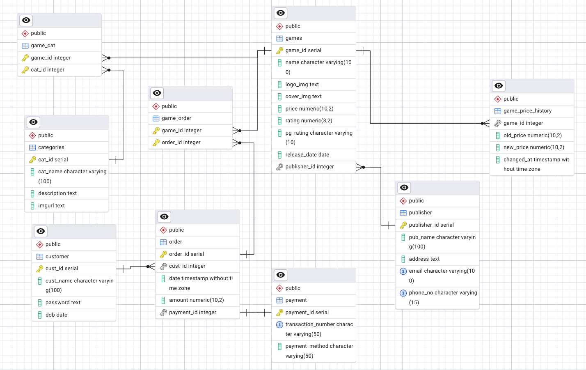
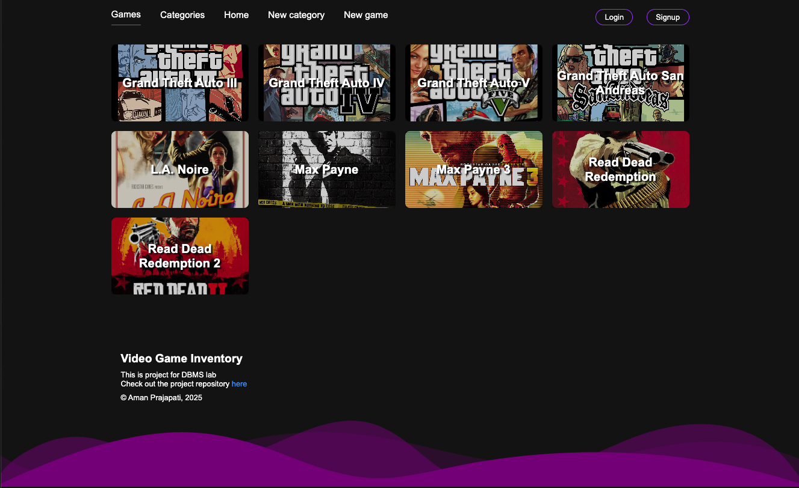
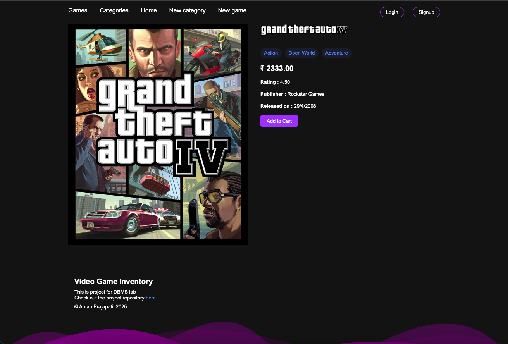
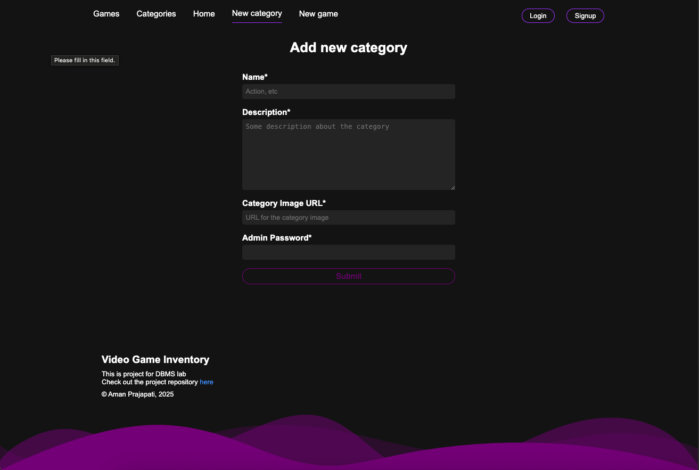
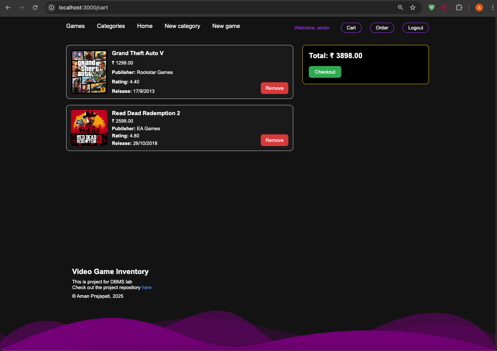
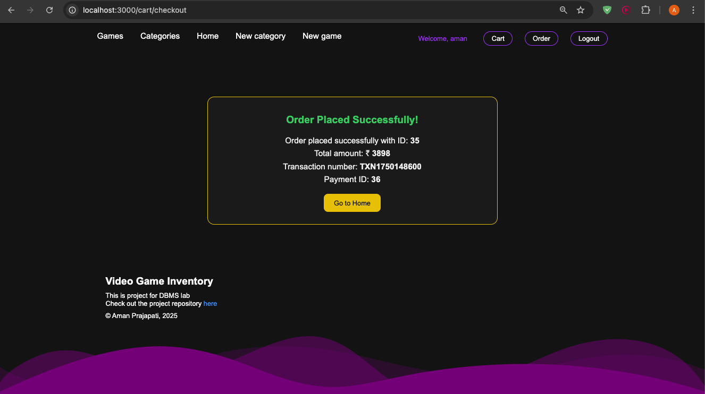

# 🎮 Game Inventory Web App

This is a full-stack **Game Inventory Management System** built using **Node.js**, **Express**, **EJS**, and **PostgreSQL**. It allows users to browse, search, and purchase games with features like authentication, category filtering, cart management using sessions, and checkout functionality.

---

## 📌 Features

- ✅ User registration & login (session-based auth)
- 🎮 View all available games with their details
- 📂 Games categorized under multiple genres (many-to-many)
- 🛒 Add games to cart (session-based)
- 💳 Checkout and place orders (order stored in DB)
- 📈 Game price history tracking
- 📑 Admin functionalities to add games and manage categories

---

## 🧱 Tech Stack

- **Backend:** Node.js, Express
- **Templating Engine:** EJS
- **Database:** PostgreSQL
- **Session Management:** express-session
- **Styling:** Basic CSS (customizable)
- **ERD Tool:** dbdiagram.io (for schema visualization)

---

## 🗂 Database Schema

> Includes entities such as `games`, `categories`, `customers`, `orders`, and many-to-many relationships via `game_cat` and `game_order`.

---

## 📸 Screenshots

---

## 🛍 Cart & Checkout Logic

- Users can add multiple games to a cart.
- Cart data is stored in the session.
- On checkout, the order is stored in the `order` and `game_order` tables.
- Payment is recorded via the `payment` table.
- **Note:** Currently, checkout updates the DB only (no actual payment gateway integration).

---

## 📦 Future Improvements

- ✅ Payment Gateway integration (e.g., Razorpay, Stripe)
- ✅ Admin dashboard with analytics
- ✅ Email receipts on successful order
- ✅ Game reviews and ratings from users
- ✅ Filter/sort by price, category, and release date

---

## 🧑‍💻 Author

**Aman Kumar**  
📧 aman.prajapati7022@gmail.com
